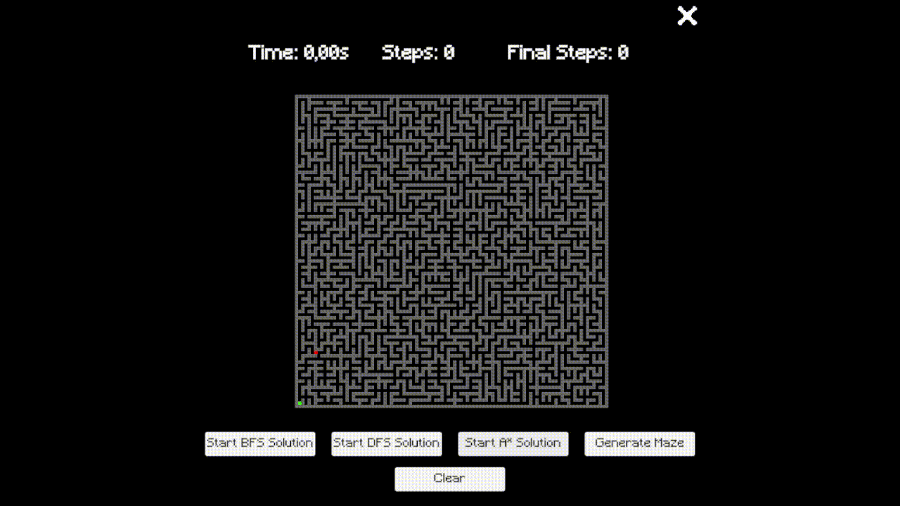

# Maze Solver & Algorithms Visualizer — Unity

<div align="center">
  
</div>

<br>

<p align="center">
  
  
  
</p>

---

This is a maze solver visualizer.

It doesn't just find the exit; it shows you exactly how much the algorithm struggled to get there. It’s a project built to visualize pathfinding logic in real-time, watching the "flood" of a BFS or the "tunnel vision" of a DFS.

The code is organized to be modular, so adding a new algorithm won't cause a total system collapse (hopefully).

---

## What this is

A Unity tool for learning and visualizing pathfinding, featuring:

- **Real-time Step Visualization**: Watch the exploration process tile by tile.
- **Multiple Algorithms**: Compare how different logics approach the same maze.
- **Decoupled Architecture**: Logic is separated from Unity's Tilemap rendering.
- **Performance Metrics**: Real-time timer and step counter to judge the efficiency of the "brains."

---

## Algorithms Included

### Generation
- **Aldous-Broder**: A slow but reliable algorithm that creates a uniform spanning tree maze. It wanders around until every tile is visited.

### Solving
- **BFS (Breadth-First Search)**: The perfectionist. Guaranteed shortest path, but explores everything like a spilled drink on the floor.
- **DFS (Depth-First Search)**: The reckless explorer. Very fast at finding *a* path, but usually it's the most chaotic and longest one possible.
- **(A-Star)**: The smart one. Uses Manhattan distance heuristics to stop wasting time and go straight for the target.

---

## How to use it

You have two options.

### 1. Just run the build

1. Go to the Releases section of this repository.
2. Download the latest build for your platform.
3. Unzip it and run the executable.
4. Pick a maze solver solution and see how it works.
5. Press **Generate** to create new mazes with diferents starting and target points

### 2. Open the project in Unity

1. Clone or download the repository.
2. Open it in **Unity 2022.3+**.
3. Open the main scene, which contains:
   - the maze generator
   - the mazes solvers

---

## Status

- **Maze Generation**: Stable (Aldous-Broder).
- **Solving Logic**: BFS, DFS, and A* fully functional.
- **UI**: Real-time stats (Time/Steps) working.

---

## Project Structure

```text
Assets/
└── Scripts/
    ├── Abstractions/
    │   └── (abstract classes / base classes for maze solvers)
    ├── Algorithms/
    │   └── (BFS, DFS, A*, Aldous-Broder)
    ├── Editor/
    │   └── (custom inspectors / editor tooling)
    ├── Manager/
    │   └── (High-level orchestration between the algorithms, the generator         
    │       and the renderer)
    └── UI/
        └── (Handles `UIHandler` and TextMeshPro elements for timers, buttons and step 
            counters)